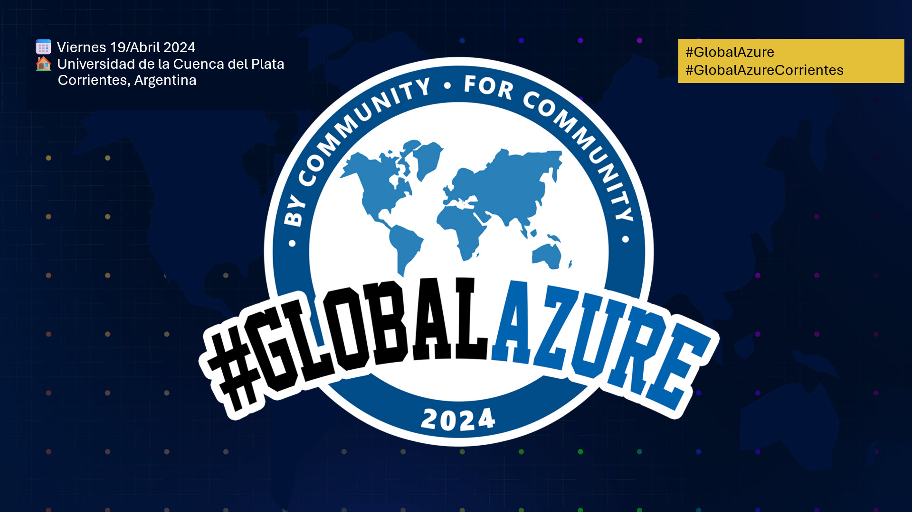
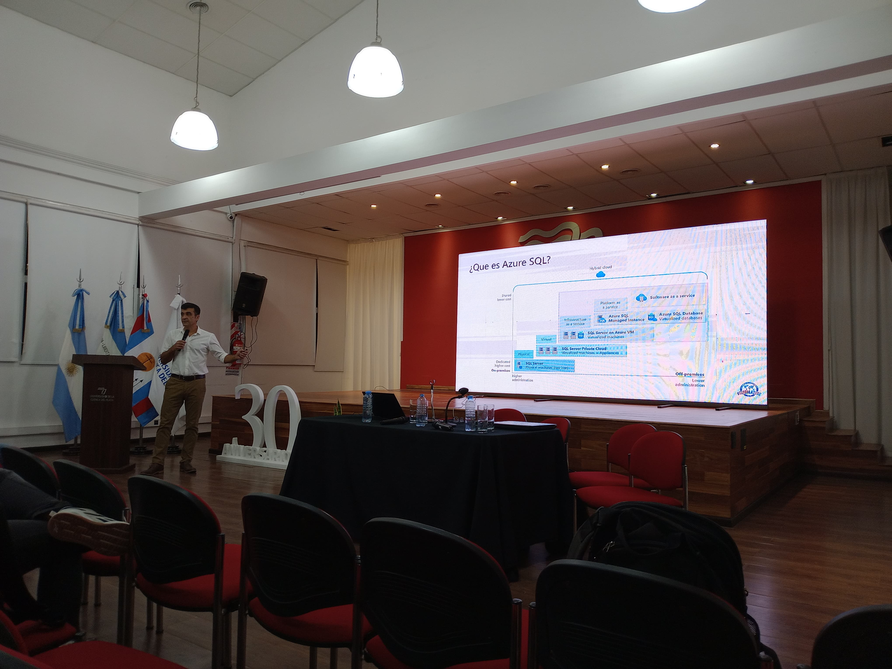
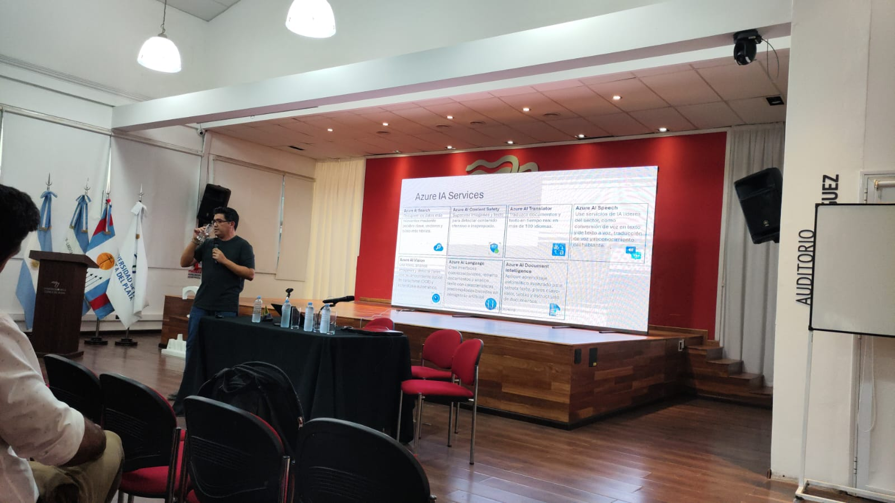
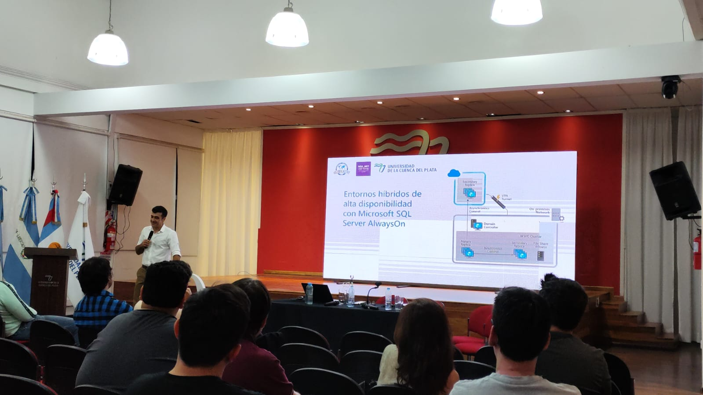
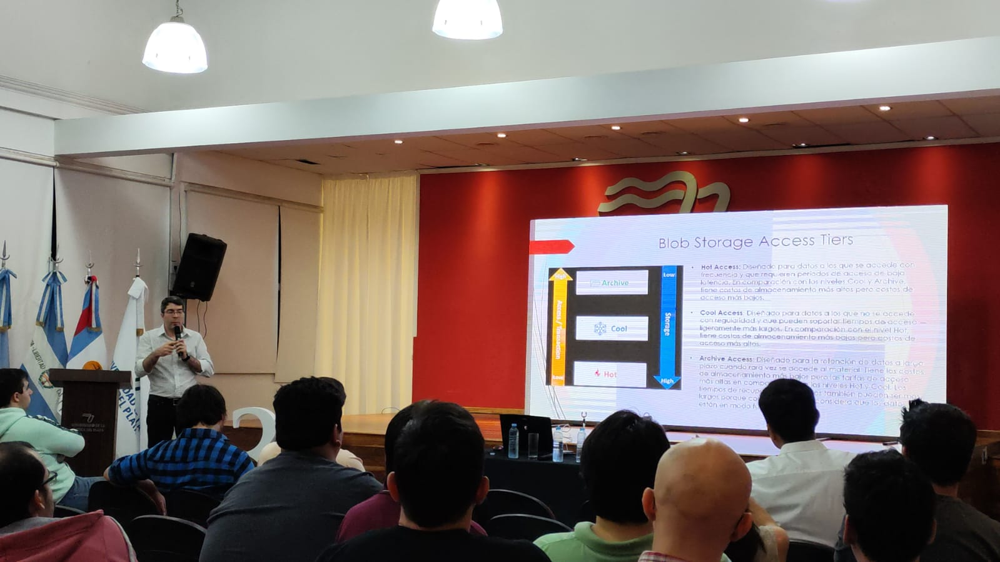
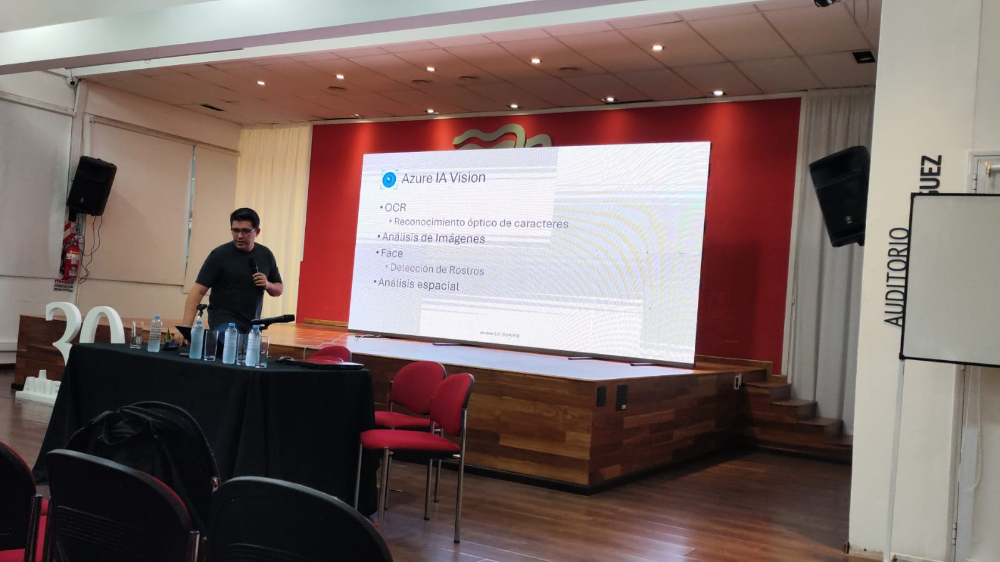
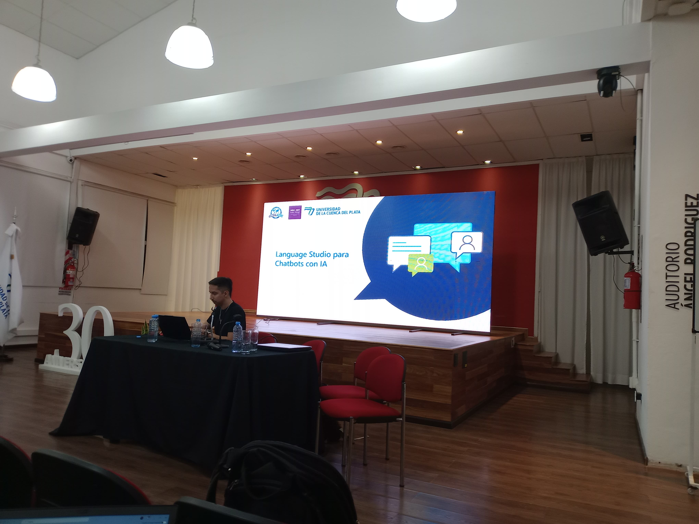

# GlobalAzure 2024 Corrientes (Argentina)

Global Azure Corrientes (Argentina), es un evento organizado por la comunidad .NET de la región NEA .NET en colaboración con la Universidad de la Cuenca del Plata

El próximo Viernes 19 de Abril de 2024 a las 18hs, nos encontraremos para compartir las novedades y mejores practicas para el uso de Azure. En esta oportunidad contamos con una sede presencial en la [UCP | Universidad de la Cuenca del Plata, Corrientes, Argentina] (https://www.ucp.edu.ar)

## Información:

 + 📅 Viernes 19 de Abril de 2024 18hs
 + 🏠 Lavalle 50, Corrientes Capital | Universidad de la Cuenca del Plata, Sede Central, Corrientes, Argentina
 + 🎫 Evento gratuito con registro previo. .
  

## Temas/Oradores

| Topic | Speaker | Demo |  
| --- | --- |  --- |
| Agregando a nuestras apps servicios de IA: Ejemplos con Azure IA Vision | Ing. Jose A. Fernandez &nbsp; | [Demo](https://github.com/fernandezja/talk-azure-ia-vision)|
| Gestionando el almacenamiento en la nube escalable con Azure blob service | Ing. Marcos Polischuk &nbsp;  | [Demo](https://github.com/MPolischuk/azure2024-carpinchazure)|
| Entornos híbridos de alta disponibilidad con Microsoft SQL Server AlwaysOn | Ing. Humberto Oraison |&nbsp; |
| Chatbots con IA utilizando Language Studio | Ing. Augusto Portillo  &nbsp;   |[Demo](https://github.com/portisk8/whatsapp-pizza-bot) |

## Fotos y Videos

<video src="./photos-and-videos/GlobalAzure-2024-Corrientes-video-01.mp4" width="250" />